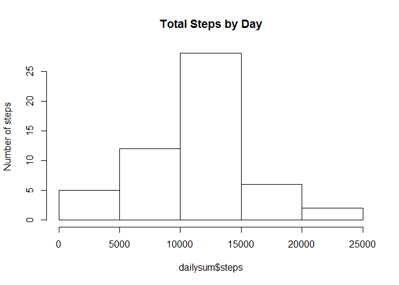
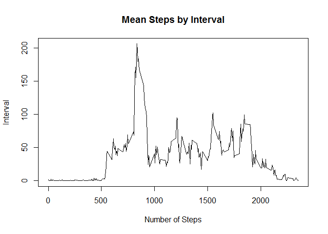
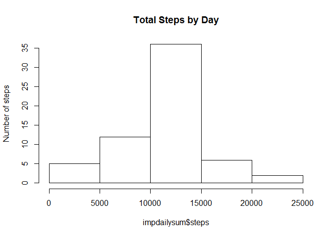

# Reproducable Research Project 1
Ian Alexander  
March 6, 2016  

####Load the data (i.e. read.csv())


```r
act <- read.csv("C:/Users/Ian/Documents/R/Reproduceable/activity.csv")
```


####Process/transform the data (if necessary) into a format suitable for your analysis

The date must be refomated as a date.


```r
act$date <- as.Date(act$date)
```

####Calculate the total number of steps taken per day


```r
dailysum <- aggregate(steps ~ date, act, sum, na.rm=TRUE)
```

####Make a histogram of the total number of steps taken each day


```r
hist(dailysum$steps, main = "Total Steps by Day", ylab = "Number of steps")
```

<!-- -->

####Calculate and report the mean and median of the total number of steps taken per day

```r
mean(dailysum$steps)
```

```
## [1] 10766.19
```

```r
median(dailysum$steps)
```

```
## [1] 10765
```

####Make a time series plot (i.e. type = "l") of the 5-minute interval (x-axis) and the average number of steps taken, averaged across all days (y-axis)

```r
intvmean <- aggregate(steps ~ interval, act, mean,  na.rm = TRUE)
plot( intvmean$interval, intvmean$steps, type='l', main = "Mean Steps by Interval", ylab = "Interval", xlab = "Number of Steps")
```

<!-- -->

####Which 5-minute interval, on average across all the days in the dataset, contains the maximum number of steps?

```r
intvmean$interval[max(intvmean$steps)]
```

```
## [1] 1705
```

####Calculate and report the total number of missing values in the dataset (i.e. the total number of rows with NAs)

```r
sum(is.na(act$steps))
```

```
## [1] 2304
```

####Create a new dataset that is equal to the original dataset but with the missing data filled in.

I have replaced the NA values with the mean of that interval.


```r
impact <- act 
for (i in 1:nrow(impact)) {
    if (is.na(impact$steps[i])) {
        impact$steps[i] <- intvmean[which(impact$interval[i] == intvmean$interval), ]$steps
    }
}
```

####Make a histogram of the total number of steps taken each day and Calculate and report the mean and median total number of steps taken per day. Do these values differ from the estimates from the first part of the assignment? What is the impact of imputing missing data on the estimates of the total daily number of steps?

The mean and histogram remain the same, while the median changes slightly.


```r
impdailysum <- aggregate(steps ~ date, impact, sum, na.rm=TRUE)
hist(impdailysum$steps,main = "Total Steps by Day", ylab = "Number of steps")
```

<!-- -->

```r
mean(impdailysum$steps)
```

```
## [1] 10766.19
```

```r
median(impdailysum$steps)
```

```
## [1] 10766.19
```

####Create a new factor variable in the dataset with two levels - "weekday" and "weekend" indicating whether a given date is a weekday or weekend day.


```r
temp <- weekdays(impact$date)
for (i in 1:nrow(impact)) {
    if (temp[i]=="Monday"|temp[i]=="Tuesday"|temp[i]=="Wednesday"|temp[i]=="Thursday"|temp[i]=="Friday") {
        impact$weekday[i] <- "Weekday"
    }
    else {impact$weekday[i] <- "Weekend"}
}
```

####Make a panel plot containing a time series plot (i.e. type = "l") of the 5-minute interval (x-axis) and the average number of steps taken, averaged across all weekday days or weekend days (y-axis). See the README file in the GitHub repository to see an example of what this plot should look like using simulated data.


```r
impintvmean <- aggregate(steps ~ interval + weekday, impact, mean)
library(lattice)
xyplot(impintvmean$steps ~ impintvmean$interval | impintvmean$weekday, 
       layout = c(1, 2), type = "l", 
       xlab = "Interval", ylab = "Number of steps")
```

<!-- -->
